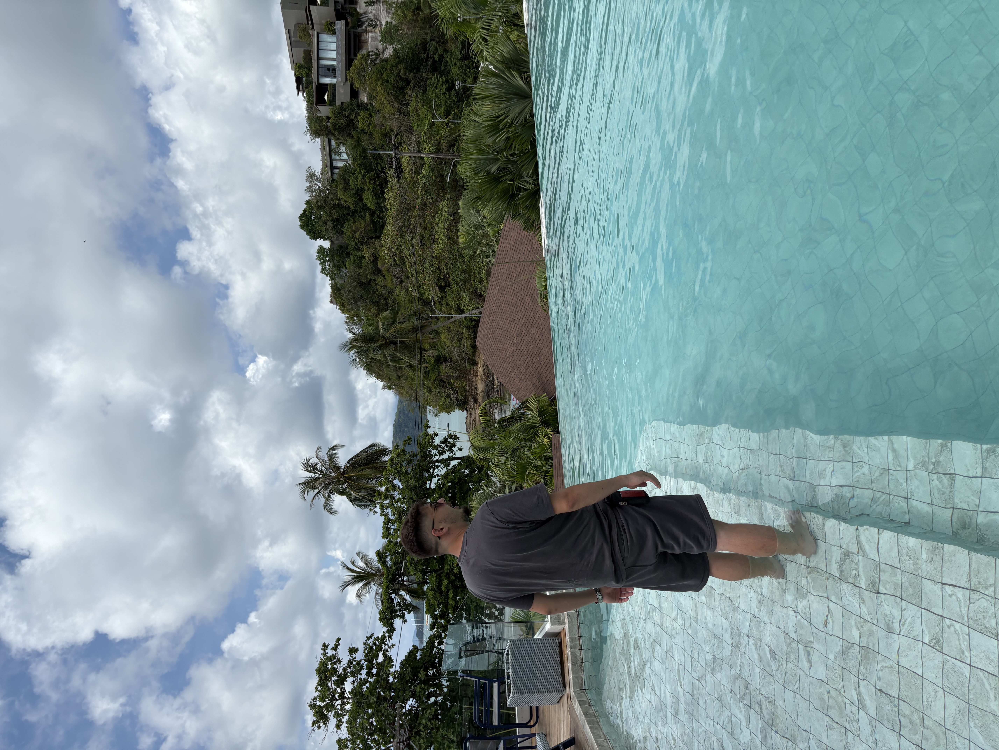

# 🌐 Bio – Persoonlijke Portfolio Website

Een voorbeeld **persoonlijke portfolio / bio-website** bedoeld voor toekomstige klanten.  
Deze site laat jouw werk, interesses en visuele stijl zien en kan worden hergebruikt of aangepast voor eigen promotie.

🎯 **Doel:**  
Professionaliseer je online aanwezigheid met een eenvoudige, aantrekkelijke landing page die jouw verhaal vertelt.

---

## 📌 Inhoud van deze repository

📂 **Bestanden & mappen**
- `index.html` – de hoofdpagina van je website  
- `img*.jpg / .jpeg / .png` – afbeeldingen gebruikt in de bio/portfolio  
- `.github/workflows/` & `templates/` – GitHub-workflow & sjablonen (optioneel)  
- etc.:contentReference[oaicite:1]{index=1}

---

## 🚀 Functionaliteit

✔️ Statische website (HTML, CSS, JavaScript)  
✔️ Visuele presentatie met afbeeldingen  
✔️ Geschikt als portfolio/bio pagina voor klanten

---

## 🛠️ Lokale weergave (how-to)

**Zo bekijk je de site lokaal:**

1. Clone deze repository:
   ```bash
   git clone https://github.com/frknatalay42-png/bio.git
Ga naar de projectmap:

bash
Code kopiëren
cd bio
Open index.html in je browser (dubbelklik, of via live server).

📦 Technologieën
HTML

CSS

JavaScript

Optioneel: GitHub Pages voor hosting

📌 Hosting (optioneel)
Je kunt deze site gratis hosten via GitHub Pages:

Ga naar Settings → Pages

Selecteer de main branch + /root

Klik op Save

Je site wordt gepubliceerd als:

bash
Code kopiëren
https://frknatalay42-png.github.io/bio
📷 Screenshots & Voorbeeld
Voeg hier eventueel preview-afbeeldingen van de website toe:

markdown
Code kopiëren


(Vervang namen door juiste afbeeldingsbestanden uit de repo)

📬 Contact
Wil je samenwerken of heb je vragen?
📧 E-mail: <jouw e-mail hier>

LinkedIn • Website • Portfolio

⭐ Dankwoord
Bedankt voor het bekijken van dit project!
Als je dit nuttig vindt, laat een ster ⭐ achter op GitHub 😊
